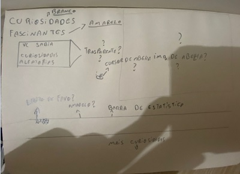
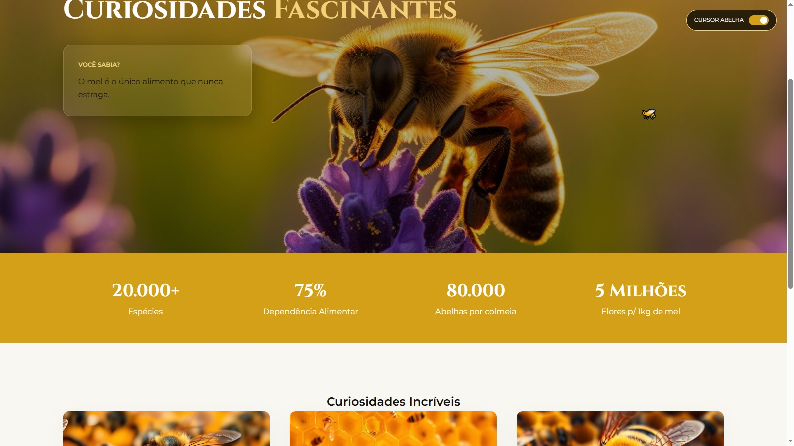

Mundo das Abelhas  – Landing Page

Esse projeto foi criado para explorar o universo das abelhas através de uma experiência web visualmente rica e interativa.
A ideia foi unir design moderno com boas práticas de desenvolvimento front-end, criando uma landing page bonita, responsiva e dinâmica.

O objetivo não foi apenas fazer uma página informativa, mas também experimentar efeitos visuais, interatividade e organização de código, simulando um projeto mais profissional.

Tecnologias utilizadas

HTML5 – estrutura semântica da página

CSS3 – layout com Flexbox e Grid, variáveis CSS e animações

JavaScript (Vanilla) – interatividade, manipulação do DOM e efeitos dinâmicos

Alguns recursos do projeto

Durante o desenvolvimento eu quis testar algumas ideias de interface moderna:

Glassmorphism
Uso de backdrop-filter para criar o efeito de vidro nos elementos da interface.

Efeito Parallax
O fundo da página reage ao scroll, criando sensação de profundidade.

Sistema de temas automático
As tags de curiosidades mudam de estilo automaticamente através de um pequeno dicionário de temas em JavaScript.

Cursor personalizado
O cursor vira uma abelha com um pequeno rastro de partículas simulando pólen.

Layout responsivo
A página se adapta a diferentes tamanhos de tela.

Processo de criação

Antes de começar a codificar, fiz um rascunho simples no papel para organizar as ideias de layout.
Depois transformei esse esboço na versão final do site.

Rascunho	
 Resultado final	

 Como visualizar o projeto

Clone o repositório:

git clone https://github.com/SEU-USUARIO/beeworld-premium.git

Abra a pasta do projeto.

Execute o arquivo index.html no navegador.
